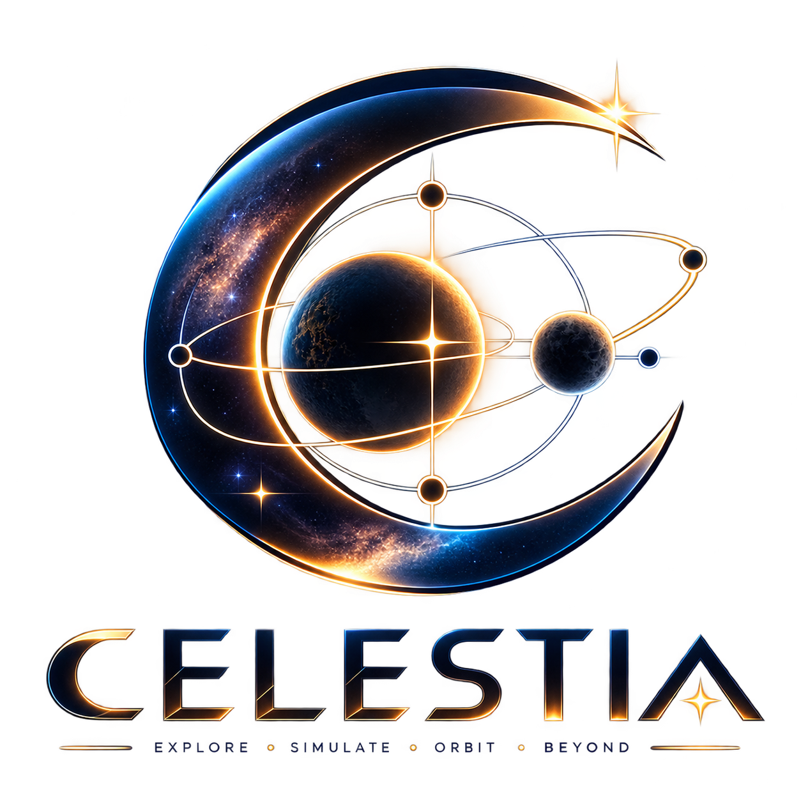

<div align="center">



# ✦ CELESTIA ✦

### Orbital Dynamics Laboratory

**Cosmic Code Hackathon 2026 · BMS College of Engineering**

<br>


&nbsp;

&nbsp;


<br><br>

> **Explore. Perturb. Simulate. Understand.**
>
> Celestia is an interactive orbital dynamics laboratory for studying the
> **Circular Restricted Three-Body Problem (CR3BP)**, Lagrange-point equilibria,
> orbital stability, perturbation response, and rotating-frame dynamics.

</div>

---

## 🎥 Demonstration

<br>

<div align="center">
  <video src="https://github.com/user-attachments/assets/5e6ecf11-f7f7-44ba-a35e-475ac50cb04f" width="85%" controls autoplay loop muted style="border-radius: 12px; box-shadow: 0 4px 14px rgba(0,0,0,0.2);"></video>
</div>

<br>

<div align="center">

**Celestia in action — from system configuration to numerical simulation, rotating-frame visualization, telemetry, and cinematic rendering.**

</div>

---

## 🌌 What is Celestia?

**Celestia** is an interactive numerical laboratory designed to make the mathematics and dynamics of the **Circular Restricted Three-Body Problem** tangible.

Instead of simply displaying precomputed Lagrange points, Celestia allows the user to:

* configure two gravitationally interacting primary bodies;
* calculate the corresponding mass ratio `μ`;
* dynamically solve for all five Lagrange points;
* inspect the effective gravitational potential;
* select an equilibrium point;
* deliberately perturb a test satellite;
* numerically integrate its subsequent motion;
* transform the resulting trajectory into the rotating reference frame;
* analyze the stability of the selected equilibrium;
* inspect telemetry such as deviation, Jacobi constant, mass ratio, and orbital period;
* and finally render the simulation as a cinematic orbital animation.

The result is a complete pipeline:

```text
        MASSIVE BODIES
              │
              ▼
        Mass Ratio μ
              │
              ▼
      Lagrange Point Solver
              │
       ┌──────┴──────┐
       ▼             ▼
   Equilibrium    Potential
     Geometry      Landscape
       │
       ▼
  Satellite Placement
       │
       ▼
  Position / Velocity
     Perturbation
       │
       ▼
   REBOUND + IAS15
       │
       ▼
 Inertial Trajectory
       │
       ▼
 Rotating-Frame Transform
       │
       ├───────────────┐
       ▼               ▼
 Stability         Visualization
 Analysis          + Telemetry
       │               │
       └───────┬───────┘
               ▼
        Cinematic Export
             Manim
```

---

# ✨ Why Celestia?

Most educational demonstrations of Lagrange points stop at showing five markers around two bodies.

Celestia goes further.

It combines **analytical orbital mechanics**, **numerical root finding**, **high-accuracy N-body integration**, **linear stability analysis**, **reference-frame transformations**, and **interactive scientific visualization** into one environment.

The central question is not:

> *"Where are the Lagrange points?"*

It is:

> **"What happens when we disturb a satellite from one of them?"**

That distinction is the foundation of the project.

---

# 🔭 Core Scientific Model

Celestia uses the **Circular Restricted Three-Body Problem (CR3BP)**.

The system consists of:

1. A primary body with mass `m₁`
2. A secondary body with mass `m₂`
3. A massless satellite / test particle

The satellite experiences the gravitational influence of both primary bodies, while its own mass is assumed negligible.

The two primaries orbit their common barycenter.

---

## 1. Normalized Mass Ratio

The system is parameterized by:

$$ \mu = \frac{m_2}{m_1+m_2} $$

where:

* `m₁` = primary mass
* `m₂` = secondary mass
* `μ` = normalized mass ratio

Celestia calculates this dynamically from the selected bodies.

In normalized CR3BP coordinates, the barycenter is placed at the origin and the primaries are positioned at:

$$ x_1=-\mu $$

$$ x_2=1-\mu $$

This coordinate system is used throughout the Lagrange-point calculations.

---

# 🛰️ Lagrange Point Solver

Celestia calculates all five classical equilibrium points dynamically, combining numerical root-finding with analytical geometry.

### 📍 The Collinear Points (L1, L2, L3)
The three collinear points lie along the axis connecting the two primary bodies. They are found by solving the nonlinear equilibrium equation:

$$ x - (1-\mu)\frac{x+\mu}{|x+\mu|^3} - \mu\frac{x-1+\mu}{|x-1+\mu|^3} = 0 $$

We utilize `scipy.optimize.brentq` for robust bracketed root solving (with a Newton-method fallback) to locate these points:
- **L1**: Between the two primary bodies.
- **L2**: Beyond the secondary body.
- **L3**: Beyond the primary body on the opposite side.

---

### 🔺 The Triangular Points (L4, L5)
The L4 and L5 points have an elegant, analytical closed-form solution. They form equilateral triangles with the primary bodies:

$$ L_{4,5} = \left(\frac{1}{2}-\mu, \pm\frac{\sqrt{3}}{2}\right) $$

---

# ⚖️ Effective Potential

Celestia also calculates the effective potential in the rotating frame:

$$ \Omega(x,y) = \frac{1-\mu}{r_1} + \frac{\mu}{r_2} + \frac{x^2+y^2}{2} $$

where:

$$ r_1=\sqrt{(x+\mu)^2+y^2} $$

and

$$ r_2=\sqrt{(x-1+\mu)^2+y^2} $$

The effective potential is used to generate the interactive **3D Potential Terrain** visualization.

This provides a geometric interpretation of the gravitational and centrifugal structure of the rotating frame.

---

# 🧭 Stability Analysis

Celestia does not simply hard-code the stability labels.

The selected equilibrium point is locally linearized.

The Hessian of the effective potential is estimated numerically:

$$ \Omega_{xx},\quad \Omega_{yy},\quad \Omega_{xy} $$

using central finite differences.

These derivatives are then used to construct the linearized rotating-frame system:

$$ A= \begin{bmatrix} 0&0&1&0\\ 0&0&0&1\\ \Omega_{xx}&\Omega_{xy}&0&2\\ \Omega_{xy}&\Omega_{yy}&-2&0 \end{bmatrix} $$

Celestia calculates the eigenvalues of this matrix.

The equilibrium is classified according to the real parts of those eigenvalues:

```text
positive real eigenvalue
        ↓
     unstable

no positive real component
        ↓
      stable
```

This allows the application to distinguish stable and unstable equilibrium behavior using the local dynamics of the system rather than purely visual rules.

---

# 🚀 Perturbation Laboratory

This is the central interactive experiment in Celestia.

After selecting a Lagrange point, the satellite can be displaced using three independent controls:

### Position

**Radial perturbation**

Moves the satellite toward or away from the equilibrium region.

**Tangential perturbation**

Moves the satellite sideways relative to the selected point.

### Velocity

**Velocity perturbation**

Adds an additional velocity component to the satellite's initial state.

The resulting state becomes:

```text
Ideal equilibrium state
        +
position perturbation
        +
velocity perturbation
        ↓
Numerical initial conditions
        ↓
Orbital evolution
```

This allows users to experimentally observe the difference between an equilibrium configuration and a perturbed trajectory.

---

# 🧮 Numerical Integration

The actual orbital evolution is performed using **REBOUND**.

Celestia creates a normalized gravitational simulation with:

```python
sim.G = 1.0
sim.integrator = "ias15"
```

The two primary bodies are initialized in circular motion around their barycenter.

The satellite is inserted as a:

```python
m = 0.0
```

massless test particle.

This is consistent with the restricted three-body approximation: the satellite responds to the gravitational field but does not modify the motion of the two primary bodies.

---

# 🎯 Why IAS15?

Celestia uses REBOUND's **IAS15** integrator.

IAS15 is a high-accuracy adaptive integrator designed for gravitational dynamics.

This is particularly useful for Celestia because the application is not merely trying to produce visually plausible trajectories.

It is investigating the response of a satellite to small changes in its initial state.

Numerical accuracy therefore matters.

---

# 🔄 Inertial Frame → Rotating Frame

REBOUND evolves the system in an inertial reference frame.

However, Lagrange points are stationary only when viewed from the rotating frame of the two-body system.

Celestia therefore transforms the numerical trajectory.

For:

$$ \theta=\omega t $$

the rotating-frame coordinates are:

$$ x_r=x\cos\theta+y\sin\theta $$

$$ y_r=-x\sin\theta+y\cos\theta $$

This transformation is implemented in `frames.py` using vectorized NumPy operations.

The result is a trajectory that can be interpreted relative to the moving primary bodies and their equilibrium points.

---

# 📊 Telemetry

Once a simulation has been generated, Celestia exposes numerical telemetry including:

| Metric                | Meaning                                                                  |
| --------------------- | ------------------------------------------------------------------------ |
| **Maximum Deviation** | Largest displacement of the simulated trajectory from its starting point |
| **Jacobi Constant**   | Rotating-frame conserved quantity used to characterize the trajectory    |
| **Mass Ratio μ**      | Normalized secondary-to-total mass ratio                                 |
| **Orbital Period**    | Characteristic orbital period calculated from the system parameters      |

The Jacobi constant is calculated as:

$$ C=2\Omega(x,y)-(v_x^2+v_y^2) $$

This provides an additional dynamical quantity alongside the visual trajectory.

---

# 🌌 Visualization System

Celestia provides multiple visualization modes.

## 2D Orbital Plane

The primary scientific view.

It displays:

* primary bodies;
* barycentric geometry;
* L1–L5;
* L4/L5 triangular geometry;
* satellite trajectory;
* rotating-frame motion;
* interactive map selection;
* animated trajectory playback.

---

## 3D Potential Terrain

The effective potential is sampled over a spatial grid and rendered as an interactive 3D surface.

This gives the user a visual representation of the underlying rotating-frame potential field.

It is particularly useful for understanding why equilibrium points exist and how the gravitational landscape changes around the system.

---

## Cinematic Orbit

The cinematic visualization presents the same numerical simulation as a polished orbital animation.

It includes:

* rotating primary bodies;
* Lagrange points;
* orbital paths;
* satellite motion;
* trajectory history;
* starfield;
* dynamic labels;
* playback controls.

The visualization is generated with Plotly and animated through frame updates.

---

# 🎬 Cinematic Video Rendering

Celestia also contains a dedicated **Manim rendering pipeline**.

The trajectory generated by the numerical simulation can be passed into `manim_viz.py`.

The renderer creates:

* a deep-space environment;
* dynamically scaled primary bodies;
* glowing orbital objects;
* body labels;
* a live satellite probe;
* rotating-frame motion;
* trajectory traces;
* an inertial trail;
* smooth animation.

The final output is rendered as an MP4 animation.

This creates a separation between:

```text
Scientific computation
        ↓
Numerical trajectory
        ↓
Interactive visualization
        ↓
Presentation-quality rendering
```

The scientific result and the cinematic presentation therefore use the same underlying trajectory.

---

# 🪐 Supported Systems

Celestia includes a built-in mass catalogue containing:

* Sun
* Mercury
* Venus
* Earth
* Moon
* Mars
* Jupiter
* Saturn
* Uranus
* Neptune
* Pluto
* Custom

The system can therefore be used to explore a range of mass ratios.

Custom bodies can also be configured manually.

When both bodies are set to **Custom**, the orbital map can be used interactively to place the two bodies and derive their separation from the selected coordinates.

---

# 🖱️ Interactive Workflow

A typical Celestia experiment looks like this:

### 01 — Configure the system

Choose the primary and secondary bodies.

```text
Primary Body
Secondary Body
Separation
```

Celestia calculates:

$$ \mu=\frac{m_2}{m_1+m_2} $$

---

### 02 — Inspect the equilibrium geometry

The five Lagrange points are calculated dynamically.

```text
             L4

              ◆

L3 ◆ ─── Primary ─── L1 ─── Secondary ─── ◆ L2

              ◆

             L5
```

---

### 03 — Select an equilibrium

Choose:

```text
L1
L2
L3
L4
L5
```

The interface displays the corresponding stability classification.

---

### 04 — Perturb the satellite

Adjust:

```text
Move in / out
Move sideways
Velocity trim
```

---

### 05 — Integrate

Celestia initializes REBOUND and numerically integrates the system using IAS15.

---

### 06 — Transform the trajectory

The inertial trajectory is converted into rotating-frame coordinates.

---

### 07 — Analyze

Inspect:

* trajectory shape;
* stability;
* maximum deviation;
* Jacobi constant;
* mass ratio;
* orbital period.

---

### 08 — Render

Export the simulation as a cinematic Manim animation.

---

# 🧑‍💻 Code Structure & Architecture

Celestia's codebase is designed with a strict separation of concerns, ensuring scientific rigor while maintaining an interactive, real-time user interface.

<details open>
<summary><b><code>app.py</code> — The Application Core</b></summary>
<blockquote>
Orchestrates the entire Streamlit application. It manages the UI layout, captures user input for system configuration and perturbations, and wires together the physics engine, numerical simulation, and rendering pipelines. 
<br><i>Key responsibilities: State management, Telemetry display, Video export triggering.</i>
</blockquote>
</details>

<details>
<summary><b><code>physics.py</code> — CR3BP Mathematics</b></summary>
<blockquote>
The analytical heart of Celestia. Implements the <i>Circular Restricted Three-Body Problem</i> equations, dynamically calculating the normalized mass ratio (<code>μ</code>) and the precise coordinates of the five Lagrange points.
<br><i>Key methods: <code>compute_L1</code>, <code>compute_L2</code>, <code>compute_L3</code>, Eigenvalue stability analysis, Jacobi constant derivation.</i>
</blockquote>
</details>

<details>
<summary><b><code>rebound_sim.py</code> — Numerical Dynamics Engine</b></summary>
<blockquote>
Wraps the powerful <b>REBOUND</b> N-body library. Initializes the primary bodies and the test satellite, then performs high-accuracy numerical integration using the <b>IAS15</b> integrator to trace the perturbed trajectory over time.
</blockquote>
</details>

<details>
<summary><b><code>frames.py</code> — Coordinate Transformations</b></summary>
<blockquote>
A dedicated module for translating the inertial trajectories calculated by REBOUND into the rotating reference frame of the two primary bodies, making the Lagrange points appear stationary.
</blockquote>
</details>

<details>
<summary><b><code>viz.py</code> & <code>manim_viz.py</code> — The Visualization Layer</b></summary>
<blockquote>
<b><code>viz.py</code>:</b> Uses <i>Plotly</i> to render the interactive 2D orbital plane and the rich 3D potential terrain.<br>
<b><code>manim_viz.py</code>:</b> An advanced rendering pipeline using <i>Manim</i> to export the numerical simulation into a presentation-quality, cinematic MP4 animation.
</blockquote>
</details>

<br>

```text
celestia/
├── app.py             # Main Streamlit UI & Orchestration
├── physics.py         # CR3BP Math, Lagrange solvers, Stability
├── rebound_sim.py     # REBOUND/IAS15 numerical integration
├── frames.py          # Inertial → Rotating transformations
├── viz.py             # Plotly 2D/3D Interactive graphics
├── manim_viz.py       # Manim Cinematic MP4 generation
├── requirements.txt   # Dependencies
└── logo.png           # Visual identity
```

---

# 🛠️ Technology Stack

<div align="center">

| Technology    | Role                                    |
| ------------- | --------------------------------------- |
| **Python**    | Core implementation                     |
| **Streamlit** | Interactive scientific application      |
| **NumPy**     | Numerical computation and vectorization |
| **SciPy**     | Numerical root finding                  |
| **REBOUND**   | Gravitational N-body integration        |
| **IAS15**     | High-accuracy numerical integrator      |
| **Plotly**    | Interactive 2D/3D visualization         |
| **Manim**     | Cinematic scientific rendering          |
| **FFmpeg**    | Video encoding / rendering dependency   |

</div>

---

# 🚀 Getting Started

## Prerequisites

Celestia requires:

* Python 3.x
* `pip`
* FFmpeg
* a system capable of running Streamlit and the Manim rendering stack

FFmpeg is required for the cinematic video-rendering pipeline.

---

## Installation

Clone the repository:

```bash
git clone https://github.com/priyanshusharan-cmd/celestia.git
cd celestia
```

Install the Python dependencies:

```bash
pip install -r requirements.txt
```

Launch Celestia:

```bash
streamlit run app.py
```

Streamlit will provide a local URL where the Orbital Dynamics Laboratory can be opened in your browser.

---

# 🔬 Running a First Experiment

A simple first experiment is an Earth–Moon configuration.

### Step 1

Select:

```text
Primary Body   → Earth
Secondary Body → Moon
```

### Step 2

Select:

```text
L4
```

### Step 3

Leave the perturbations near zero.

### Step 4

Observe the trajectory in the rotating reference frame.

### Step 5

Increase the position or velocity perturbation.

### Step 6

Compare the resulting trajectory with the equilibrium configuration.

Repeat the experiment with L1, L2, L3, L4 and L5 to observe the dramatically different dynamical behavior.

---

# 📐 Units & Normalization

Celestia's CR3BP calculations use normalized dynamical units internally.

The canonical geometry uses:

```text
Barycenter = (0, 0)
Primary 1  = (-μ, 0)
Primary 2  = (1-μ, 0)
```

The physical system is then scaled according to the selected masses and separation.

This normalization allows the same mathematical machinery to work across systems with radically different physical scales.

---

# ⚠️ Scientific Scope

Celestia is intentionally based on the **Circular Restricted Three-Body Problem**.

Therefore, the model makes important simplifying assumptions.

### The model assumes:

* the two primary bodies form the dominant gravitational system;
* their orbits are approximately circular;
* the satellite has negligible mass;
* relativistic effects are ignored;
* non-gravitational forces are ignored;
* atmospheric drag is ignored;
* solar radiation pressure is ignored;
* planetary ephemerides are not used;
* the primary bodies are treated as point masses.

Therefore, Celestia should be understood as a **scientific simulation and educational laboratory**, not as a flight-certified mission-design system.

For real mission planning, higher-fidelity ephemerides and additional perturbation models would be required.

---

# 🧠 Design Philosophy

Celestia was designed around three principles:

### 1. Physics first

The visualization should be generated from the numerical model rather than being a decorative animation disconnected from the physics.

### 2. Experiment over observation

Users should be able to perturb an equilibrium and observe the dynamical consequence.

### 3. Scientific computing should be beautiful

Complex orbital mechanics does not need to be presented through an intimidating research interface.

Celestia combines numerical rigor with a visual language inspired by spacecraft mission-control systems and deep-space instrumentation.

---

# 📈 Future Development

Possible extensions include:

* higher-fidelity planetary ephemerides;
* non-circular restricted three-body dynamics;
* solar radiation pressure;
* atmospheric drag models;
* spacecraft finite-mass modeling;
* halo and Lissajous orbit analysis;
* zero-velocity surface visualization;
* automated stability maps;
* trajectory optimization;
* fuel / Δv analysis;
* Lambert-transfer calculations;
* multi-spacecraft simulations;
* 3D spatial trajectories;
* mission-design presets for real Earth–Moon and Sun–Earth missions.

---

# 📚 Scientific Foundations

Celestia is built around classical concepts from:

* celestial mechanics;
* the Circular Restricted Three-Body Problem;
* rotating reference frames;
* gravitational potential theory;
* Lagrange equilibrium points;
* linear stability analysis;
* numerical ordinary differential equation integration;
* N-body gravitational dynamics.

The implementation intentionally exposes these concepts through interactive computation rather than treating them as static educational material.

---

# 🏆 Project Highlights

<div align="center">

### Mathematical Model

**CR3BP + dynamically solved Lagrange points**

### Numerical Engine

**REBOUND + IAS15**

### Stability

**Linearized rotating-frame eigenvalue analysis**

### Visualization

**Interactive 2D + 3D Plotly environments**

### Rendering

**Manim cinematic orbital animation**

### Interaction

**Live mass, separation and perturbation controls**

</div>

---

# 📁 Repository

```text
celestia/
│
├── app.py
├── physics.py
├── rebound_sim.py
├── frames.py
├── viz.py
├── manim_viz.py
├── requirements.txt
├── logo.png
└── README.md
```

---

# 👨‍🚀 Team & Credits

**Celestia** was developed for:

### Singularity — The Astronomical Society of BMSCE

as a submission for the **Cosmic Code Hackathon 2026**.

The project combines software engineering, numerical simulation, astronomy, orbital mechanics and scientific visualization into a single interactive laboratory.

---

<div align="center">

## ✦ Explore the Equilibria. Disturb the System. Understand the Orbit. ✦

<br>

**CELESTIA**

*Explore · Simulate · Orbit · Beyond*

<br>

<sub>
Built with Python · NumPy · SciPy · REBOUND · Plotly · Streamlit · Manim
</sub>

<br><br>

<h4>Built by <b>Priyanshu Sharan</b></h4>

<a href="https://www.linkedin.com/in/priyanshusharan/">
  
</a>

</div>

6332

63326332

6332