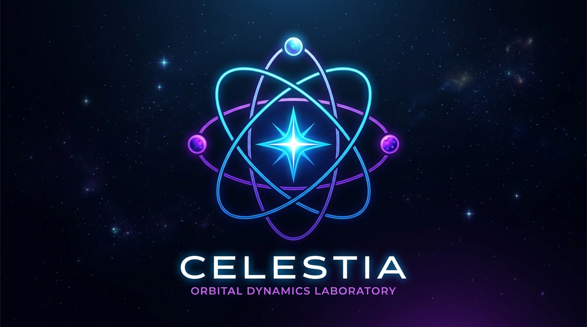

<div align="center">

  

  <h1>✦ Celestia: Orbital Dynamics Laboratory ✦</h1>
  <p><strong>Cosmic Code Hackathon 2026 Submission</strong></p>

  <br>

  <p>
    <a href="https://www.loom.com/share/03f1dd0426674b44b99479f8a24b7577"><strong>🌟 Watch the Loom Walkthrough Video Here 🌟</strong></a>
    <br><br>
    <a href="./Demo.mov"><strong>🎥 Watch the High-Res Demo Video Here 🎥</strong></a>
  </p>

  <br>
  
  <i>An interactive, scientifically rigorous orbital dynamics laboratory. <br> Simulate the Circular Restricted Three-Body Problem (CR3BP) and visualize Lagrange points.</i>

</div>

---

<div align="center">

## 🌌 Overview

**Celestia** demonstrates exactly how a satellite behaves when placed near points of gravitational equilibrium, all wrapped in a premium, immersive user interface. With real-time numerical integration and a cinematic rendering engine, explore any two massive bodies in the Solar System or beyond.

</div>

---

<div align="center">

## ✨ Features

**Live Interactive Telemetry**<br>
Adjust masses, separation, and satellite perturbations on the fly using a high-performance interface.

**Customizable Planetary Systems**<br>
Choose from our Solar System catalog or create custom bodies by clicking on the orbital map.

**Real-time Orbital Integration**<br>
Powered by the `REBOUND` N-body integrator using the high-accuracy IAS15 integrator.

**Multi-Layer Field Maps**<br>
Toggle between 2D Orbital Plane maps and 3D Potential Terrain layers.

**Cinematic Exports**<br>
Render ultra-high-quality animations of your trajectory using `Manim`.

</div>

---

<div align="center">

## 🔭 Scientific Approach

**Physics Model** | Built on the Circular Restricted Three-Body Problem (CR3BP).<br>
**Lagrange Points** | Calculated dynamically based on the mass ratio of the primary and secondary bodies.<br>
**Stability Analysis** | Real-time classification of the equilibrium regions (Stable vs Unstable).<br>
**Integration** | Evaluated via `rebound_sim.py` in a normalized inertial frame.

</div>

---

<div align="center">

## 🛠️ Built With

**[Python 3](https://www.python.org/)** • **[Streamlit](https://streamlit.io/)** • **[REBOUND](https://rebound.readthedocs.io/)**<br>
**[Manim](https://www.manim.community/)** • **[Plotly](https://plotly.com/python/)** • **[NumPy](https://numpy.org/)**

</div>

---

<div align="center">

## 🚀 How to Run

### Prerequisites
Ensure you have Python installed, along with `ffmpeg` (required for Manim's video rendering).

### Install & Launch
```bash
pip install -r requirements.txt
streamlit run app.py
```

</div>

---

<div align="center">
  <i>Build Boldly. Think Beyond the Obvious.</i><br>
  Developed for Singularity – The Astronomical Society of BMSCE
</div>
